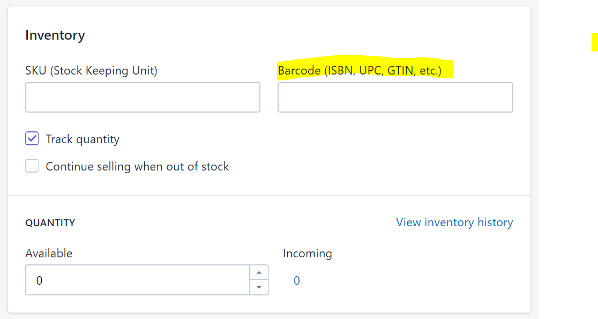
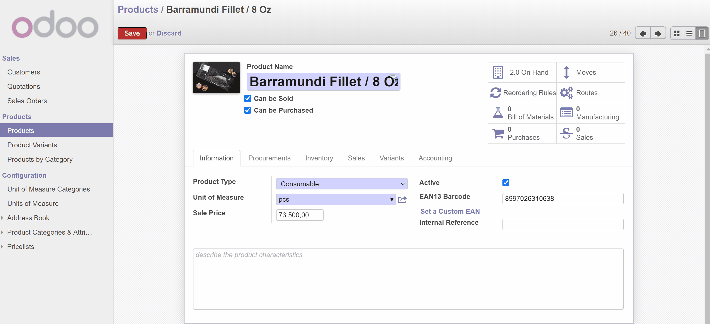

###############################
Link Shopify Product ke Odoo
###############################

.. toctree::
   :maxdepth: 0
   :caption: Contents:

.. _LinkShopifyProductOverview:

************
Overview
************

Bila barang sudah ada di Shopify tapi odoo tidak ada, maka kita bisa melakukan step ini untuk link product shopify ke odoo.

Berikut cara nya:

1. :ref:`Shopify Barcode` 
2. :ref:`Odoo Barcode`
3. :ref:`ShopifyToOdoo`

.. _Shopify Barcode:

[Shopify] Isikan barcode di section inventory
===================================================

   *Figure: Shopify > Product > [Inventory]*

.. _Odoo Barcode:

[Odoo] Isikan Ean13 di Product
===================================================

   *Figure: Odoo > Product* 

Ean13 code isikan di sini harus sama dengan Barcode yang di isikan di Shopify
