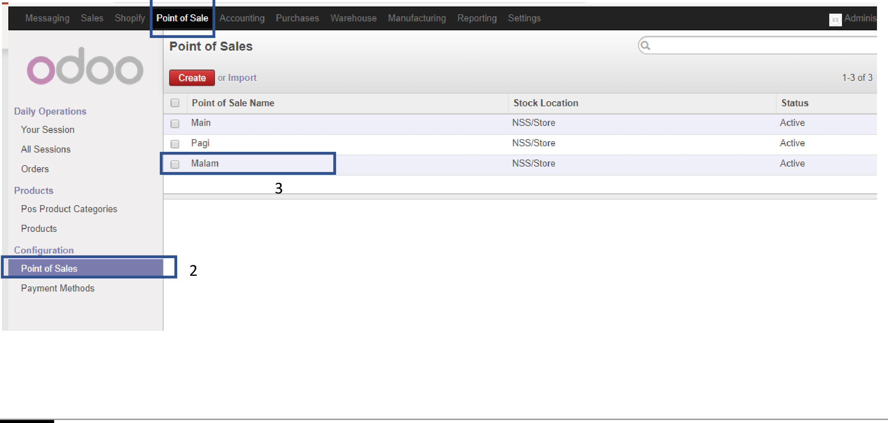
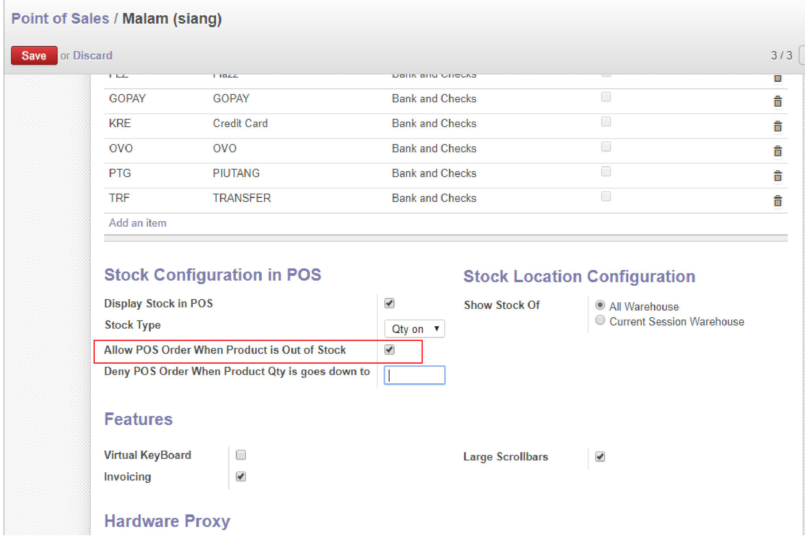

######################################################
Aktivasi POS utk tidak bisa jual tanpa stock
######################################################

.. toctree::
   :maxdepth: 2

menu ``Point of Sales > Configuration > Point Of Sales``

``Allow POS Order When Product is Out of Stock`` bila di centang maka POS masih bisa jual bila stock tidak cukup/nol.
``Deny POS Orer When Product Qty is goes Down to`` di kasi nominal "-100" untuk tidak ada Deny stock bila stock kita di bawah 0.